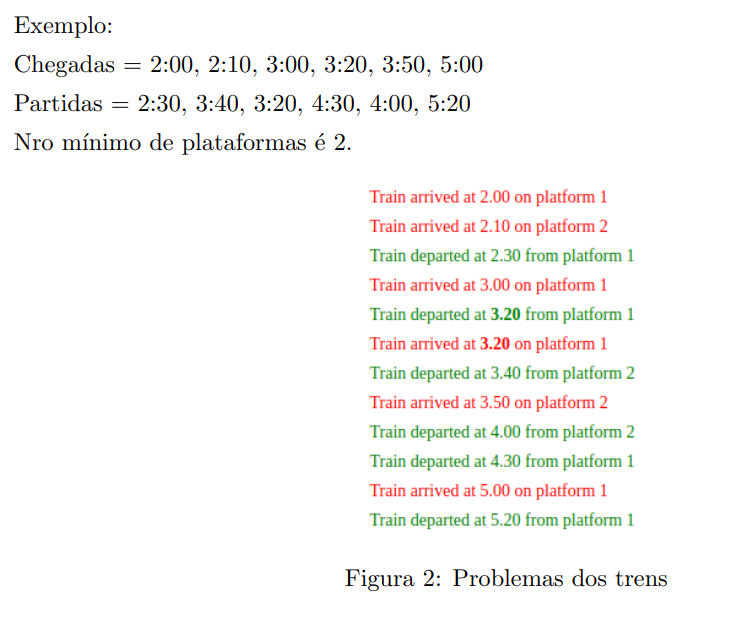

# MinimumNumberOfPlatforms
## Compilando
#### Windows
- Pelo terminal, compilar utilizando `javac MinimumNeededPlatforms.java`
- Executar o código utilizando `java MinimumNeededPlatforms`

## Problema
Encontre o número mínimo de plataformas necessárias em uma estação de forma a evitar qualquer
atraso da chegada de qualquer trem.  
Dada uma tabela com os tempos de chegada e partida de trens em uma estação, encontre o número
mínimo de plataformas necessárias na estação de forma que sejam evitados quaisquer atrasos na
chegada de quaisquer trens.  
Exemplo:  
Chegadas = 2:00, 2:10, 3:00, 3:20, 3:50, 5:00  
Partidas = 2:30, 3:40, 3:20, 4:30, 4:00, 5:20  
Nro mínimo de plataformas é 2.  

### Exemplo

## Entrada e Saída
### Formato da Entrada
- A entrada é lida do arquivo `trainTimesInput.txt`, que contém intercaladamente os horários de chegada e de partida dos trens à estação. Por exemplo:  
~~~
trainTimesInput.txt
2.00, 2.10, 3.00, 3.20, 3.50, 5.00 --> Chegada
2.30, 3.40, 3.20, 4.30, 4.00, 5.20 --> Partida
9.00, 9.40, 9.50, 11.00, 15.00, 18.00 --> Chegada
9.10, 12.00, 11.20, 11.30, 19.00, 20.00 --> Partida
9.04, 9.06, 9.22, 9.27, 15.08, 18.06 --> Chegada
9.30, 9.40, 11.28, 11.35, 19.00, 20.01 --> Partida
~~~
- Um valor de entrada consiste em uma linha com os horários das Chegadas e das Partidas

### Formato da Saída
- Para cada entrada do arquivo, a saída é dada através do terminal imprimindo a seguinte mensagem: `Minimum number of platforms: X`, onde 'X' é o número de plataformas necessárias para atender a demanda de trens na estação

## Estratégia Utilizada
- O problema foi solucionado utilizando a estratégia gulosa
- A ideia consiste em, dados os horários de Chegada e Partida dos trens, percorrê-los cronologicamente (ou seja, por ordem de horários).  Sendo assim, adicionamos um contador `currentTrains` que mantém a contagem de quantos Trens estão na estação em determinado horário.  Se o próximo Evento for a chegada de um trem na estação, aumentamos o contador; caso contrário, o diminuimos.
- Mais informações a respeito da implementação podem ser encontrados nos comentários dentro do código-fonte

#### Informações Extras
- O código fonte encontra-se sob o diretório raíz, no arquivo `./MinimumNeededPlatforms.java`
